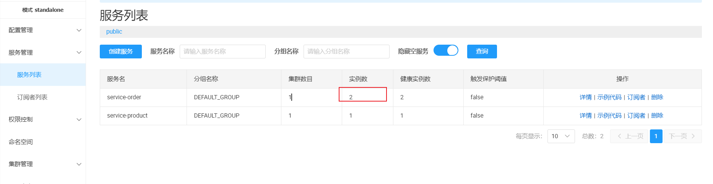

### SpringCloud 

#### 分布式概念

1. 单体


1. 集群

为例解决单体服务性能的局限性。我们可以复制多个单体项目（副本）多部署几台服务器。这样就有一个问题，怎么根据我们的域名 找到我们的服务，因为我们有多台服务器。可以引入网关Nginx,完成请求的路由，负载均衡的算法，均摊给服务器。当然并发多了，数据库也要复制副本，集群搭建。

1. 分布式

模板化升级导致牵一发动全身，比如订单模块 如果经常更新 v1 v2 v3 ， 只修改了这一个模块，还要导致全部模块重启服务。

多语言的模块话合作    C++直播模块。

按照业务功能模块拆分。 拆分成的模块，叫做微服务。 数据库也可以拆分，按照业务的边界，这样就每个业务就连接自己的数据库。


由于不在一个服务器上，需要用其他请求，就可以远程调用（ RPC）


假如我的一个微服务模块宕机了（避免单体故障，应该将微服务的副本多方在不同的服务器上。）怎么知道他的副本在哪？ 可以使用  服务发现 服务注册， 也就是nacos。 每一个微服务模块和他的副本要告知nacos,自己的服务名，和地址。  其他微服务模块需要远程调用其他微服务模块，就可以通过nacos 发现服务的地址，同时如果发现多个服务器都提供该功能，可以负载均衡分发。

配置中心： 同一管理 所有的配置（版本控制），并且配置发生改变会push到服务端， 我们的服务就可以不停机的修改。


百万用户的请求： 一个微服务的卡顿，导致整个调用链的卡顿，请求的堆积导致服务器资源的耗尽，导致服务雪崩。引入服务熔断机制。 在远程调用期间，发现服务出错了（配置熔断的规则）， 直接返回null或则其他缓存，快速失败。


现在每个服务器都不是完整的应用请求，域名绑定那里呢？之前集群模式下，用Ngnix随便给那个服务都可以。但是现在不能随便分发，要配置路由规则，也就是假如请求 /order，就转发到order服务器上（Nginx去nacos中发现服务），处理期间，连接上属于自己的数据库，而在业务层面，数据库需要交互， 下订单 ---->用户加积分。 要保持数据的一致性。要解决分布式事务(seata)。


#### 分布式实战

****

[版本发布说明-阿里云Spring Cloud Alibaba官网](https://sca.aliyun.com/docs/2022/overview/version-explain/?spm=7145af80.1ef41eac.0.0.1fa12d5b5SFXD1)

示例demo


## Nacos

nacos 是一个配置中心，服务注册，服务发现。作为配置中心的好处，可以统一管理配置文件（微服务中，当配置文件多了之后，每个业务的配置中心）包括版本控制，实时更新等等。（只考配置中心）。

服务注册，服务发现。是分布式系统下的核心， 我们将单机项目拆分成微服务，并且保证其单点故障性，会有很多的服务器上有微服务的副本，我们只要是微服务我们都可以将其注册到nacos中， 等到之后RPC调用，也是通nacos找到调用的服务。

参考文档：[Nacos 快速开始 | Nacos 官网](https://nacos.io/docs/latest/quickstart/quick-start/?spm=5238cd80.2ef5001f.0.0.3f613b7cKZKWRs)

1.下载： [发布历史 | Nacos 官网](https://nacos.io/download/release-history/)

在 nacos/bin 目录下启动    注意选择启动方式： standalone单机

```shell
startup.cmd -m standalone
```

2. 地址：http://127.0.0.1:8848/nacos  默认用户名密码 都是 nacos


### 服务注册

---


服务注册，主要是对分布式架构下微服务来说的。

1. 初始化微服务 引入依赖

```xml
<dependencies>
            <dependency>
                <groupId>org.springframework.boot</groupId>
                <artifactId>spring-boot-starter-web</artifactId>
            </dependency>
    <!--        nacos 服务注册与发现-->
        <dependency>
            <groupId>com.alibaba.cloud</groupId>
            <artifactId>spring-cloud-starter-alibaba-nacos-discovery </artifactId>
        </dependency>
    
</dependencies>
```

2. 编写配置

主要就是配置nacos的地址

```java
spring:
  application:
    name: service-order

  cloud:
    nacos:
      config:
        server-addr: 127.0.0.1:8848  # nacos 地址

server:
  port: 8082
```

编写启动类测试


服务就注册成功了！

为了演示微服务下的模式，我们可以多启动结果不同端口的演示


添加参数 --server.port = 8083

会在未启动的列表


启动测试




以上就是服务注册。


### 服务发现

开启服务发现的功能 ： **@EnableDiscoveryClient**

在微服务项目启动类开启

```java
@EnableDiscoveryClient
@SpringBootApplication
public class OrderMainApplication {
    public static void main(String[] args) {
        SpringApplication.run(OrderMainApplication.class,args);
    }
}

```

测试 服务发现API

**DiscoveryClient**和 **NacosDiscoveryClient**

两者的区别，就是前者是标准Spring提供的。后者式nacos提供的。

```java
@SpringBootTest
public class DiscoveryTest {


    @Autowired
     DiscoveryClient discoveryClient;

    @Resource
    NacosDiscoveryClient nacosDiscoveryClient;

    @Test
    public void DiscoveryClientTest() {

        //获得服务名
        List<String> services = discoveryClient.getServices();
        for (String service : services) {
            System.out.println(service);
            //根据服务名 获得服务实例信息
            List<ServiceInstance> instances = discoveryClient.getInstances(service);
            for (ServiceInstance instance : instances) {
                System.out.println(instance.getHost());
                System.out.println(instance.getPort());
            }
        }

    }


    @Test
    public void NacosDiscoveryClientTest() {
        List<String> services = nacosDiscoveryClient.getServices();
        for (String service : services) {
            System.out.println(service);
            nacosDiscoveryClient.getInstances(service).forEach(instance -> {
                System.out.println(instance.getHost());
                System.out.println(instance.getPort());
            });
        }
    }


}
```


我们正常使用的时候，开启@EnableDiscoveryClient 就行。确保开启服务发现。后续使用的时候，我们不用单独的用服务发现的API去获取服务，而是集成好了。


### RestTemplate 远程调用

由于我们是微服务项目， product 项目和 order项目是分开的。

处理这样的一个业务逻辑，生成订单的时候，需要product的数据。该怎么办，像是单体项目，我们直接在order 中引入productService去解决。但是现在两个业务时分开的怎么办？

答案就是我们在创建订单的时候，去远程调用product 获取商品信息的接口。 怎么调用？可以使用RestTemplate。

我们写两个接口，商品接口和订单接口。


商品接口

----


```java
@RestController
@RequestMapping("/product")
public class ProductController {

    @Autowired
    private ProductService productService;

    @GetMapping("/{productId}")
    public  Product getProduct(@PathVariable long productId){

        return  productService.getProduct(productId);

    }

}
```

```java
@Service
public class ProductServiceImpl implements ProductService {


    @Override
    public Product getProduct(long productId) {
        Product product = new Product();

        product.setId(productId);
        product.setPrice(BigDecimal.valueOf(100));
        product.setProductName("小苹果");
        product.setNum(5);

        return product;
    }
}
```

测试


同时其他副本下也可以


----


订单接口

```java
@RestController
@RequestMapping("/order")
public class OrderController {


    @Autowired
    private OrderService orderService;

    /**
     * 创建订单
     * @param userId
     * @param productId
     * @return
     */
    @GetMapping("/create")
    public Order createOrder(@RequestParam("userId") Long userId, @RequestParam("productId") Long productId) {

        return orderService.getOrder(userId,productId);
    }


}
```


```java
@Service
@Slf4j
public class OrderServiceImpl implements OrderService {


    @Autowired
    private RestTemplate restTemplate;

    @Autowired
    private DiscoveryClient   discoveryClient;
    @Override
    public Order getOrder(Long userId, Long productId) {


        Order order = new Order();
        order.setId(2025L);
        order.setUserId(userId);

        order.setUsername("hnsqls");

        order.setAddr("河南商丘");


//  todo 调用商品表计算
        Product product = getProductFromRemote(productId);
        int num = product.getNum();
        BigDecimal price = product.getPrice();
        BigDecimal money = new BigDecimal(num).multiply(price);
        order.setTotalPrice(money);
        List<Product> products = new ArrayList<>();
        products.add(product);
        order.setProducts(products);
        return order;
    }


    //远程调用
    public Product getProductFromRemote(Long productId){
       

        List<ServiceInstance> instances = discoveryClient.getInstances("service-product");
            ServiceInstance serviceInstance = instances.get(0);
        String url = "http://"+serviceInstance.getHost()+":"+serviceInstance.getPort()+"/product/"+productId;
              log.info("远程调用商品服务，获取商品信息，url:{}",url);


        return restTemplate.getForObject(url, Product.class);

    }
}
```

注意 要配置RestTemplate (建议使用配置类来管理)

```java
@Configuration
public class RestTemplateConfig {

    @Bean
    public RestTemplate restTemplate(){
        return new RestTemplate();
    }


}
```


测试


但是通过日志，发现一个问题，就是我们的调用的远程服务，永远都是一个，


因为我们在代码中写死了都是永远调用存活实例的第一个

```java
 ServiceInstance serviceInstance = instances.get(0);
```


我们想要负载均衡的调用远程服务怎么办？

